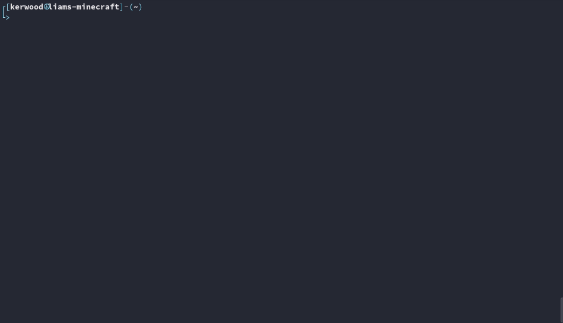

# Minecraft CLI

This is a Minecraft CLI tool written in Rust.

My 10 year old son wanted to be able to create Minecraft servers, so I saw an opportunity to try and make him comfortable with a Linux terminal from an early age. Creating Minecraft servers using containers really makes it easy, but the Docker learning curve might be just a bit too steep for a 10 year old. That's why I created this CLI tool.

Behind the scene it creates containers using Podman or Docker. When creating a new Minecraft container Podman/Docker will assign the container a random port which you will use to connect to the Minecraft server.

I recommend using Podman instead of Docker because, if you restart a container with Docker, it will assign a new random port to the container. Podman will not, it will keep the original port given. Another reason to use Podman is that it does not require root privileges to create a container. You can have multiple users running Mincraft servers and they will only be able see and manage their own containers.


The image used for the Minecraft container is [itzg/minecraft-server](https://github.com/itzg/docker-minecraft-server). 




```
mcli 0.1.0

USAGE:
    mcli <SUBCOMMAND>

FLAGS:
    -h, --help       Prints help information
    -V, --version    Prints version information

SUBCOMMANDS:
    create     Create a Minecraft server.
    help       Prints this message or the help of the given subcommand(s)
    list       List all Minecraft servers.
    logs       Trail logs from a Minecraft servers.
    rcon       Start a rcon session to a Minecraft servers.
    remove     Remove a Minecraft server.
    restart    Restart a Minecraft servers.
    start      Start a Minecraft servers.
    stop       Stop a Minecraft servers.
```


## Examples

Create a new survival game with a map type of default.
``` 
mcli create my-survival-world
``` 

Create a new creative game with a map type of flat.
``` 
mcli create -m creative -t flat my-creative-world
``` 

Here's the different create options.
```
OPTIONS:
    -h, --heap <heap>          Sets the maximum Java memory-heap limit. Support format/units as <size>[g|G|m|M|k|K]
                               [default: 1G]
    -t, --type <level-type>    Minecraft map type. Possible values: default, flat, largebiomes, amplified, buffet
                               [default: default]
    -m, --mode <mode>          Minecraft game mode. Possible values: creative, survival, adventure
                               [default: survival]
```

List all Minecraft servers.
```
$ mcli list

  ███╗   ███╗██╗███╗   ██╗███████╗ ██████╗██████╗  █████╗ ███████╗████████╗
  ████╗ ████║██║████╗  ██║██╔════╝██╔════╝██╔══██╗██╔══██╗██╔════╝╚══██╔══╝
  ██╔████╔██║██║██╔██╗ ██║█████╗  ██║     ██████╔╝███████║█████╗     ██║   
  ██║╚██╔╝██║██║██║╚██╗██║██╔══╝  ██║     ██╔══██╗██╔══██║██╔══╝     ██║   
  ██║ ╚═╝ ██║██║██║ ╚████║███████╗╚██████╗██║  ██║██║  ██║██║        ██║   
  ╚═╝     ╚═╝╚═╝╚═╝  ╚═══╝╚══════╝ ╚═════╝╚═╝  ╚═╝╚═╝  ╚═╝╚═╝        ╚═╝   

 Name                  Mode       Type      Port    Status              Created
 water-world           Creative   Flat      40395   Up 35 days ago      2021-04-16 20:36:26.823133136 +0200 CEST
 merrilds-mining-inc   Survival   Buffet    35529   Up 10 days ago      2021-05-01 20:46:37.766618488 +0200 CEST
 black-sea             Survival   Default   44439   Up 3 seconds ago    2021-05-10 20:47:11.876404933 +0200 CEST
```

Tail logs from a server.
```
mcli logs my-survival-world
```

Connect to RCON.
```
mcli rcon my-survival-world
```

Remove a Minecraft server.
```
mcli remove my-survival-world
```


